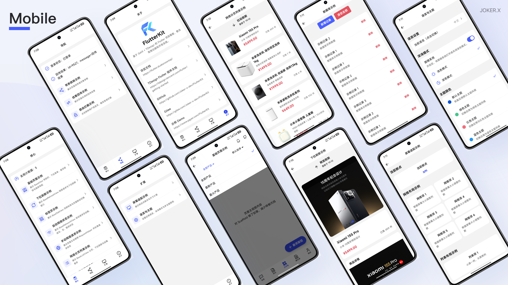
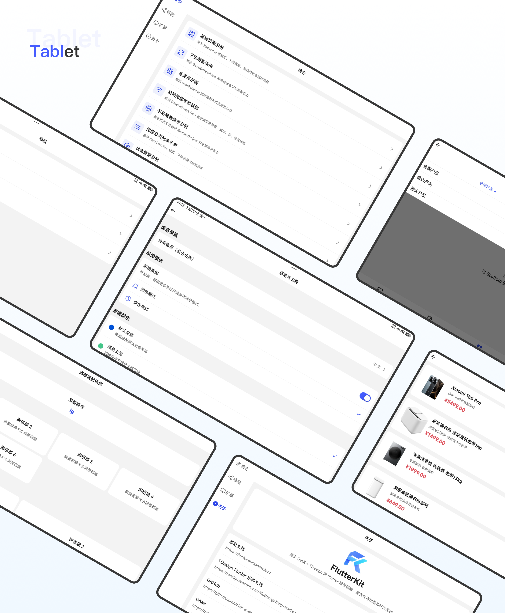
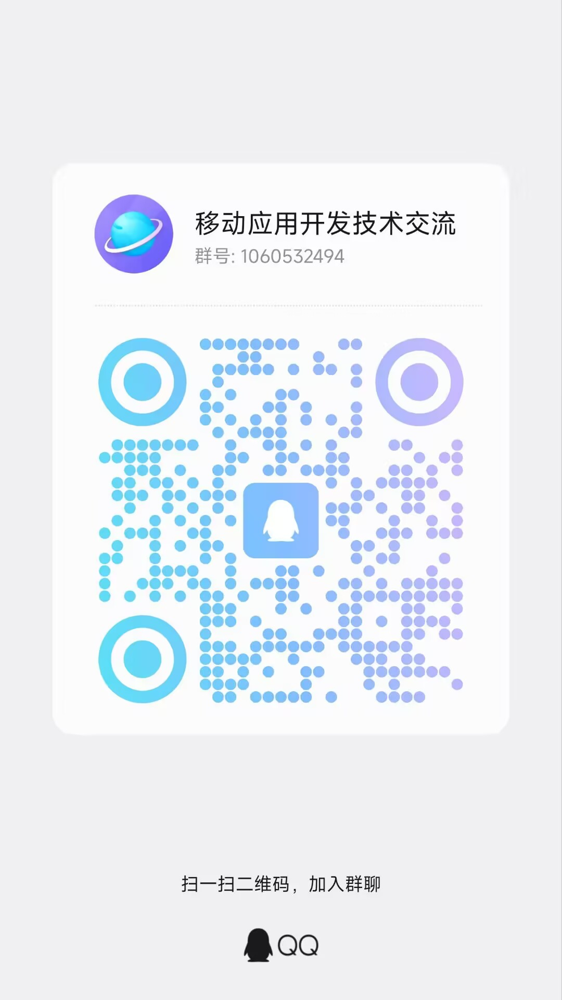

<div align="center">


# FlutterKit

_A modular, out-of-the-box Flutter scaffold with AI-assisted development support_

<!-- Language Switch Button -->
<div align="center">
  <a href="README.md">🌍 中文</a>
</div>

[](https://github.com/Joker-x-dev/FlutterKit)
[](https://gitee.com/Joker-x-dev/FlutterKit)
[](https://flutter.dusksnow.top)
[](https://tdesign.tencent.com/flutter/getting-started)
[](https://deepwiki.com/Joker-x-dev/FlutterKit)

</div>

## 📖 Project overview

FlutterKit is a cross-platform project scaffold built with **Flutter / Dart / GetX / TDesign Flutter**. It includes networking, paging, database, local storage, state management, navigation, internationalization, theming, and responsive layout, together with runnable demo pages. The goal is simple: **clone → run → build**.

Native projects for Android, iOS, macOS, Linux, Windows, and Web are included and can be used as the foundation of a modular Flutter application.

> If FlutterKit helps your project, please give it a Star ⭐. It supports continued maintenance.

## 📱 Project preview

FlutterKit includes Widget Preview support for pages and components. Responsive page previews cover Mobile, Tablet, and Foldable screen sizes.





### 📍 Project links

- **GitHub**: https://github.com/Joker-x-dev/FlutterKit
- **Gitee**: https://gitee.com/Joker-x-dev/FlutterKit
- **Demo**: [Download](https://www.pgyer.com/FlutterKit)

### 📚 Documentation

- **FlutterKit docs**: [View online](https://flutter.dusksnow.top)
  - Covers quick start, architecture, module conventions, sample routes, and common customization points
- **TDesign Flutter**: [View online](https://tdesign.tencent.com/flutter/getting-started)
  - Component usage and API reference for TDesign Flutter
- **Flutter documentation**: [View online](https://docs.flutter.dev)
  - Flutter development, build, and release documentation

## 🤖 AI-assisted development

FlutterKit does not bundle an AI model or hosted AI service. Repository rules, framework documentation, and project-specific Skills provide structured context for AI development tools that support them.

- **Project rules**: [`AGENTS.md`](AGENTS.md) defines architecture boundaries, UI conventions, documentation requirements, and verification steps
- **Framework docs**: [`docs/flutter-kit/`](docs/flutter-kit/README.md) and [`docs/tdesign-flutter/`](docs/tdesign-flutter/README.md) document the framework and UI components
- **Project Skills**: [`.agents/skills/`](.agents/skills/) contains nine workflows for setup, Feature development, UI, data, navigation, preview, theme, native configuration, and code review

```text
Use $fkit-feature and $fkit-ui to create a product detail page.
Use $fkit-setup to update the app name, package identifiers, icon, and splash screen.
Use $fkit-audit to review the architecture and preview coverage of feature/main.
```

See the [AI-assisted development guide](https://flutter.dusksnow.top/help/intro/ai-coding) for the full workflow.

## 🧩 Built-in capabilities

- **Base pages**: shared abstractions for View, Logic, State, Dialog, Tab, Refresh, and List pages
- **Networking**: Dio + Retrofit, interceptors, exception conversion, and unified result handling
- **Paged lists**: refresh, load more, loading, error, and empty states
- **Navigation**: named routes, typed arguments, result passing, and route guards
- **Database**: SQLite data sources and Repository examples
- **Local storage**: account, authentication, token, theme, language, and user information storage
- **State management**: GetX page state, dependency management, and global Service examples
- **Screen adaptation**: breakpoints, orientation, safe areas, and responsive phone, tablet, and foldable layouts
- **Design system**: shared colors, typography, spacing, shapes, shadows, themes, and Widget extensions
- **Internationalization**: separate common and Feature-level translations
- **Environment configuration**: dev, test, pre, and prod environments maintained in Dart; Debug supports in-app switching, while Release uses production
- **Development tools**: Alice, Pretty Dio Logger, Logger, and Widget Preview
- **AI-assisted development**: project-level rules, framework docs, and nine Skills for code generation, refactoring, and review

## 🛠️ Tech stack

| Category | Technology | Description |
| --- | --- | --- |
| Language | Dart | Flutter's official language |
| UI framework | Flutter | Cross-platform UI for Android, iOS, macOS, Linux, Windows, and Web |
| Architecture | GetX + MVVM | View, Logic, State separation and dependency management |
| UI library | TDesign Flutter | Tencent TDesign components for Flutter |
| Navigation | GetX Navigation | Named routes, arguments, results, and guards |
| Networking | Dio + Retrofit | HTTP client, declarative APIs, and interceptors |
| Serialization | json_serializable | Generated JSON model code |
| Database | sqflite | Local SQLite database |
| Local storage | shared_preferences | Cross-platform key-value storage |
| Screen adaptation | flutter_screenutil | Size adaptation and responsive layout support |
| Refresh and paging | easy_refresh | Pull-to-refresh and load-more behavior |
| Debugging | Alice + Logger | Network inspection and logging |
| Code generation | build_runner + FlutterGen | Model, API, and asset code generation |

## 📱 Feature modules

- **Main module (`main`)**
  - Main page (`main`)
  - Core capability demos (`core-demo`)
  - Navigation demos (`navigation-demo`)
  - Extension demos (`expand-demo`)
  - About page (`about-demo`)

- **Auth module (`auth`)**
  - Login page (`login`)

- **User module (`user`)**
  - User information page (`user-info`)

- **Demo module (`demo`)**
  - Base page demo (`base-demo`)
  - Base Tab demo (`base-tab-demo`)
  - Base refresh demo (`base-refresh-demo`)
  - Network request demo (`network-demo`)
  - Paged network list demo (`network-list-demo`)
  - Standalone network request demo (`network-request-demo`)
  - Database demo (`database-demo`)
  - Local storage demo (`local-storage-demo`)
  - State management demo (`state-management-demo`)
  - Navigation arguments demo (`navigation-with-args`)
  - Navigation result demo (`navigation-result`)
  - Screen adaptation demo (`screen-adapt-demo`)
  - Theme demo (`theme-demo`)

## 📁 Project structure

```text
lib/
├── bootstrap/              # App startup and service initialization
├── core/                   # Shared capabilities used by multiple Features
│   ├── base/               # Page, list, network, refresh, Tab, and dialog base classes
│   ├── config/             # App configuration
│   ├── data/               # Repositories and cross-module preview data
│   ├── database/           # SQLite data sources and entities
│   ├── datastore/          # Local key-value data sources
│   ├── design_system/      # Theme, spacing, extensions, and design conventions
│   ├── env/                # Source-based environment configuration
│   ├── localization/       # Shared translations
│   ├── mixin/              # Shared Mixins
│   ├── model/              # Entity, Request, and Response models
│   ├── network/            # Network data sources, interceptors, and Dio provider
│   ├── result/             # Request results and error handling
│   ├── service/            # Global Services
│   ├── ui/                 # Shared UI, responsive layout, and preview support
│   └── util/               # Navigation, storage, logging, and feedback utilities
├── feature/                # Feature modules
│   ├── auth/               # Authentication
│   ├── demo/               # Runnable demos
│   ├── main/               # Main shell and home pages
│   └── user/               # User module
├── generated/              # Generated asset accessors
├── routes/                 # Routes, parameters, results, and guards
├── application.dart        # Root application widget
└── main.dart               # Application entry point
```

## 🚀 Quick start

### Requirements

- Flutter SDK: `>= 3.38.0`
- Dart SDK: `>= 3.9.0 < 4.0.0`
- Android Studio, IntelliJ IDEA, or Visual Studio Code

### Install and run

```bash
flutter pub get
flutter run
```

### Code generation

Run the generator after changing JSON models, Retrofit data sources, or assets under `assets/image/`, `assets/icon/`, and `assets/json/`:

```bash
# Generate JSON, Retrofit, and FlutterGen asset accessors.
dart run build_runner build --delete-conflicting-outputs
```

Watch for changes continuously:

```bash
dart run build_runner watch --delete-conflicting-outputs
```

### Quality checks

```bash
flutter analyze
flutter test
```

## 📦 Release builds

### Android

Build an arm64 APK:

```bash
flutter build apk --release --obfuscate --split-debug-info=./debug_info --target-platform android-arm64
```

Build an AAB for Google Play:

```bash
flutter build appbundle --release --obfuscate --split-debug-info=./debug_info
```

### iOS

```bash
flutter build ios --release --obfuscate --split-debug-info=./debug_info
```

### macOS

```bash
flutter build macos --release
```

### Web

```bash
flutter build web --release
```

### Linux

```bash
flutter build linux --release
```

### Windows

```bash
flutter build windows --release
```

The `debug_info` directory contains symbol files for obfuscated builds. Keep it with the corresponding release artifact so production stack traces can be restored.

Linux and Windows applications must be built on their respective operating systems. iOS and macOS builds require macOS and Xcode.

## 👥 Join the community

Join the developer group to discuss Flutter, Android, HarmonyOS, and cross-platform architecture.

<div align="left">
  
  <p>Scan the QR code or search the group number to join</p>
</div>

## 🤝 Contributing

Issues and pull requests are welcome.

- **Code**: implement features, fix bugs, or add tests
- **Bug reports**: provide reproducible cases for bugs and compatibility issues
- **Documentation**: improve usage guides, architecture docs, and examples
- **Design**: suggest UI, interaction, and responsive layout improvements
- **Testing**: verify behavior on Android, iOS, macOS, Linux, Windows, and Web

Before submitting a pull request, run static analysis and the relevant tests, and follow the existing project structure and coding conventions.
